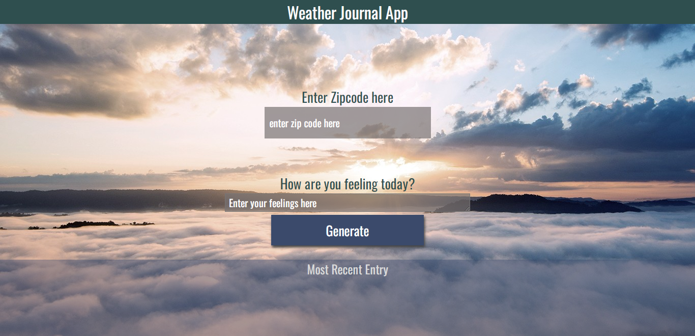

# Weather-Journal App Project
> This is a solution to the weather journal project udacity
## Table of contents

- [Overview](#overview)
- [The challenge](#the-challenge)
- [Screenshot](#screenshot)
- [Built with](#built-with)
- [What I learned](#what-i-learned)
- [Useful resources](#useful-resources)
- [Author](#author)


## Overview

### The challenge

> create an asynchronous web app that uses Web API and user data to dynamically update the UI in a Weather Journal application.

## Screenshot



## Built with

- Semantic HTML5 markup
- CSS
- Mobile-first workflow
- Javascript
- Node.js
- Express.js

## What I learned
-  How to use Asynchronous function to ```GET``` and ```POST``` data.
-  How to update UI based on data that comes from ```API```.
-  How to create local server using ```Node.js``` and ```Express.js```.
-  How to use Promise to handle data from API ```fetch()```,```then()```,```catch()```.

## Useful resources

- [MDN](https://developer.mozilla.org/en-US/docs/Web/JavaScript?retiredLocale=ar)
- [OpenWeatherMap](https://openweathermap.org/)
- [Express](https://expressjs.com/)
- [Node](https://nodejs.org/en/)


## Author

- Linkedin - [Mohamed Hesham](https://www.linkedin.com/in/mohamed-hesham-b7611618a/)

